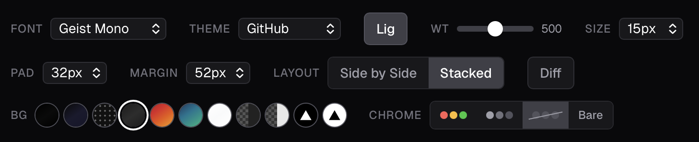

# versus.tools

Beautiful side-by-side code comparison images for social sharing.

Paste two code snippets, pick a background, export a PNG. That's it.



## Features

- Side-by-side or stacked layout
- Syntax highlighting for 12 languages (per-snippet)
- 11 syntax themes (GitHub, Solarized, Catppuccin, Monokai, Rob Pike, etc.)
- Multiple backgrounds: gradients, dots, transparent, Vercel grid
- Window chrome options: color, gray, none, bare
- Adjustable font, weight, size, padding, and margin
- Diff mode
- PNG (2x/4x) and SVG export
- All settings persisted to localStorage

## Run locally

```bash
npm install
npm run dev
```

Open [http://localhost:3000](http://localhost:3000).

## Stack

Next.js, Tailwind CSS, [Shiki](https://shiki.style), [html-to-image](https://github.com/bubkoo/html-to-image).

---

Built by [Claude Code](https://claude.ai/code).
